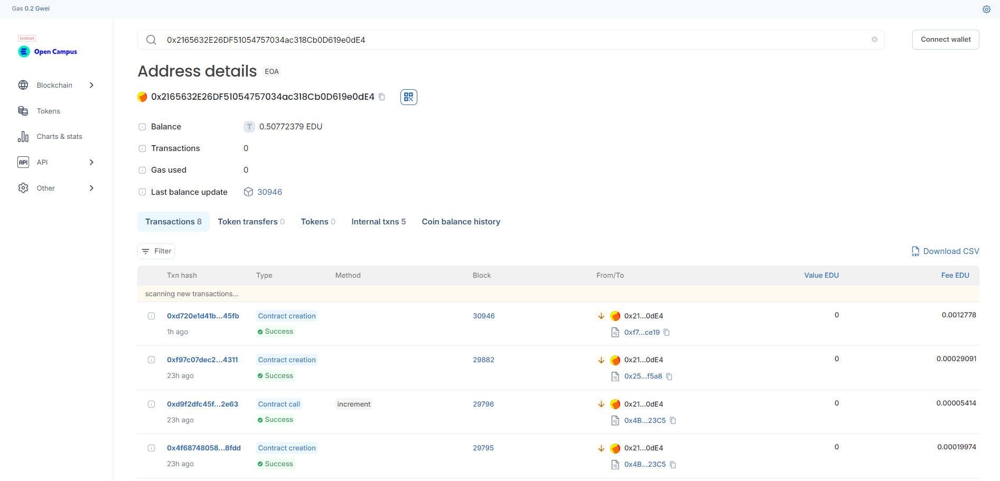

# PeerReviewIncentive Smart Contract

## Vision

The `PeerReviewIncentive` smart contract is designed to incentivize peer reviews in educational settings by rewarding reviewers with ERC20 tokens. This project aims to streamline the reward distribution process, ensuring that reviewers are compensated for their contributions in a transparent and efficient manner.

## Flowchart

```plaintext
+-------------------+
|   Instructor      |
| (Deploy Contract) |
+--------+----------+
         |
         v
+--------+----------+
|   Review Submission |
| (submitReview)      |
+--------+----------+
         |
         v
+--------+----------+
|   Review Storage   |
| (reviews mapping)  |
+--------+----------+
         |
         v
+--------+----------+
|   Reward Review    |
| (rewardReview)     |
+--------------------+
         |
         v
+--------+----------+
|   Transfer Tokens  |
| (ERC20 transfer)   |
+--------------------+
```

## Contract Address

**Contract Name**: Assignment Review
**Network**: Edu_Chain
**Contract Address**: 0x2165632E26DF51054757034ac318Cb0D619e0dE4  



## Functions

- `submitReview(address _student, string memory _assignmentHash)`: Allows users to submit a review for a student.
- `rewardReview(address _student, uint256 _reviewIndex)`: Allows the instructor to reward a review by transferring tokens to the reviewer.
- `getReviews(address _student)`: Retrieves the list of reviews for a particular student.

## Future Scope

1. **Enhanced Review Verification**: Implement mechanisms to verify the authenticity and quality of reviews.
2. **Customizable Reward Amounts**: Allow instructors to set different reward amounts based on review criteria.
3. **Automated Reward Distribution**: Explore options for automatic reward distribution based on predefined review milestones.
4. **Integration with Learning Platforms**: Develop integration with popular educational platforms for seamless review and reward processes.

## Contact

For questions or support, please contact:

**Email**: nganthoibirk15@gmail.com    
**GitHub**: https://github.com/nganthoi15 
